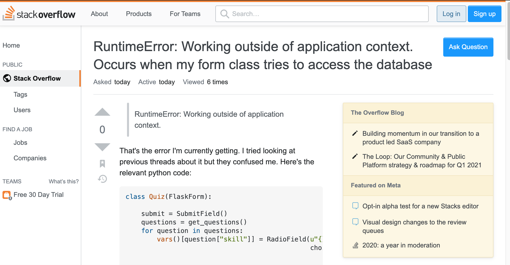

## Good Question

[Example of Good Question](https://stackoverflow.com/questions/65948673/runtimeerror-working-outside-of-application-context-occurs-when-my-form-class)
This is an example of a good question according to Eric Raymond's guidelines to asking questions. This user included in their post the research they did and how they still could not figure out their question. They included their original code and where they think their error might be. Their question is specific and not general, so that helps when people are providing answers. They also included the specific language they are using, Python, so Python programmers can help answer. 

## Dumb Question

[Example of Bad Question](https://stackoverflow.com/questions/65948680/how-to-print-all-odd-numbers-from-1-to-20-but-mod-is-used-to-get-the-remainder-i)
This question does not follow the guidelines Eric Raymond wrote out on how to ask "Smart Questions." This user did not show any attempt at doing their own research. They just posted their question to the general forum Stack Overflow. They are writing pseudocode which is very flexible because it is about algorithm and the steps not actual working code. It sounds like a question from a homework assignment, and if they are trying to solve the question they could do a little more research or ask a classmate. They did not even give an example of their attempt at the problem, which in programming is easier to debug or help solve instead of giving the whole answer.  

