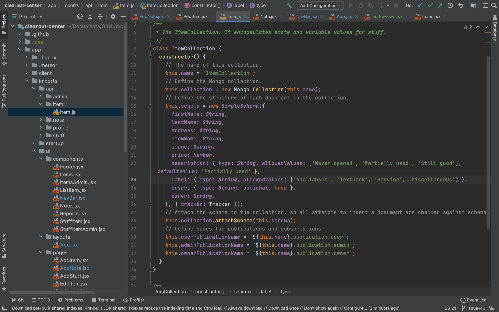
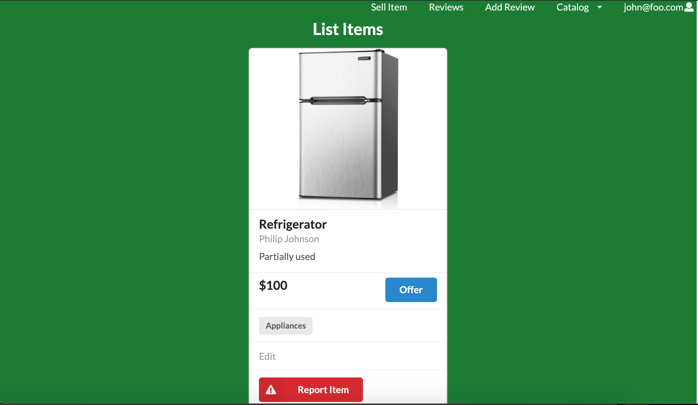
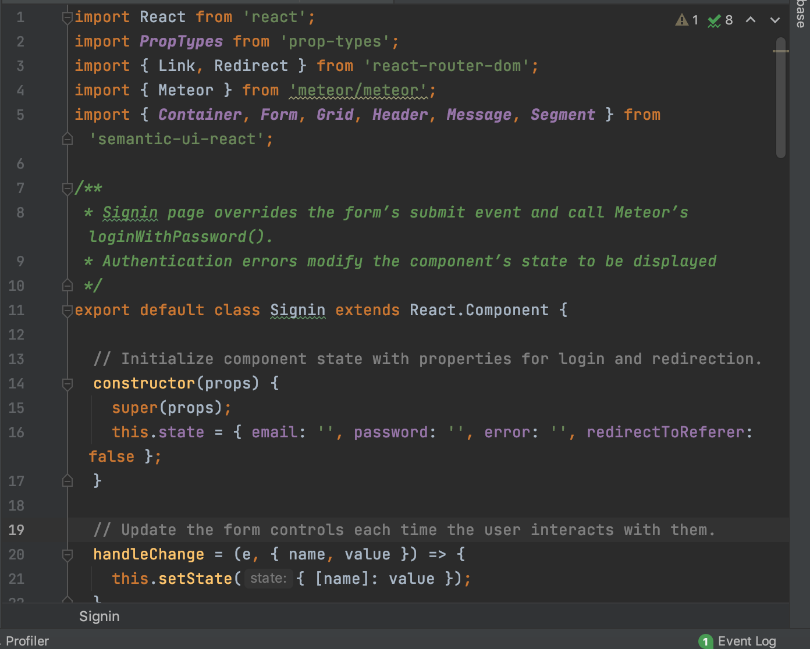

# Building a Home
A lot goes into building a house and starting from scratch can take years especially when you want to design a brand new home. Everyoen wants their home to be unique, from the layout to the tiles picked out in the kitchen. You have the design of what the house will look like in the end, you have blueprints that need to get approved by the city, and you have many people working together to bring this idea to life. 
Design Patterns are the blueprints preapproved by the city. You know they work and solve the most common problems you run into as a programmer. From there you can get into the look of your application and start designing the "outside of your new house".  

# Design
For our application, we used the "gold standard" model-view-controller design pattern. This pattern operates how most people understand an application works. 

## Model
You have the model which is the server/ database that contains the collections your application uses. 

This is what our model looks like in our program for out Items. We have a MongoDB collection to hold our default items. 

## View
Next, the view which is what your application looks like with the styles and designs you have created. 

This is what our items look like with our design and how we decided to show our items. 

## Controller
Finally, the Controller, that passes the information along from the client to the server. 

This is the controller we use to check authorized sign in, so only if you are a valid user with an account you can view these items. 

The reason this pattern is the "gold standard" is because it allows all three different designs to run at the same time. To relate it back to building a house, the model contains all the information for buidling your house. The view is what your house will look like when it is finished. And the controller is relaying information from the home owners to the builders, so they get the design right. 

