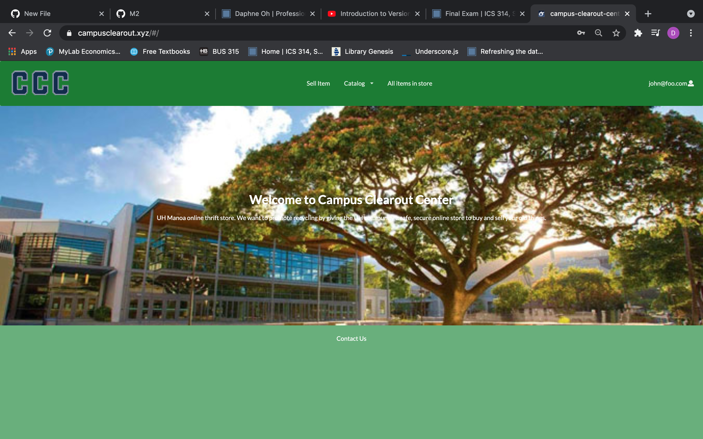

To view the project code visit : 
[campus clearout center](https://github.com/campus-clearout-center/clearout-center)

  

## Overview 
Campus Clearout Center is a program that will allow users of the UHM community to list and post various objects for sale. After all, another man’s trash is another man’s treasure. But for the UHM community this could be old textbooks, “campus-specific” goods, generally things that need to be recycled which might offer use to another student. The service will allow buyers to easily browse through the item and choose a location on campus to meet.

## Contributions
My contributions to this project was working on a page to allow users to edit their profile, creating a catalog, and allowing users to leave reviews on other's profile pages. Users can only edit certain parts of their created profile. The catalog is where users can search for specific items with the labels we have created. And users can leave their rating out of five stars with comments about other users. 

  
  
  

## What I learned
I learned how to deploy a project on Ocean React, which is a lot different than running it on a localhost:3000. I had to learn how to reconfigurate the data everytime we made an update, so it would appear on the website. I also learned how to use a unique domain and protect it using https instead of http. I also am more confortable using Github and issue driven project management. It allowed our project to not seem so overwhelming and allow things to get done in a timely manner to create our application. I also got a greater understanding of how to use collections with MongoDB and how to find and fix little bugs that showed up. Testing was also a useful tool that I learned with this project. That way we knew our project was working and could fix whatever problems arised. 
