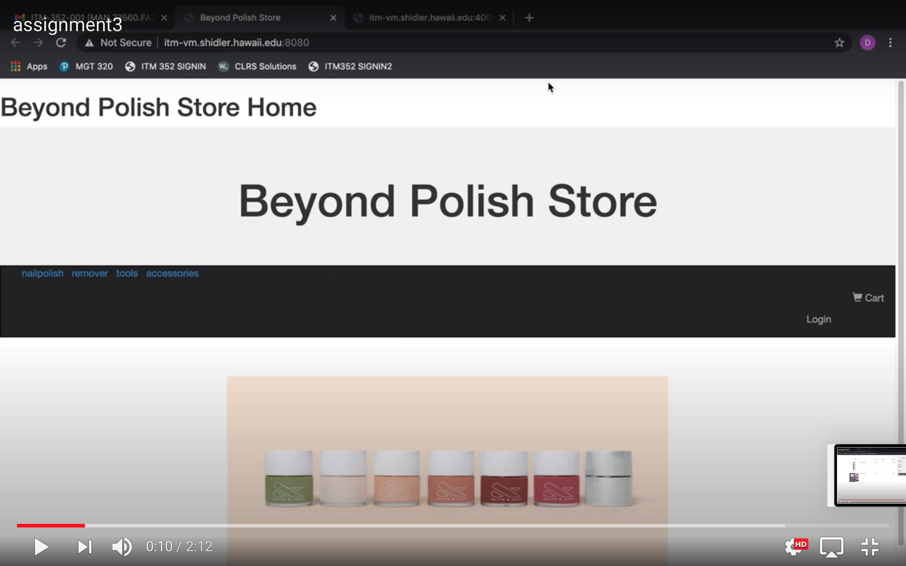
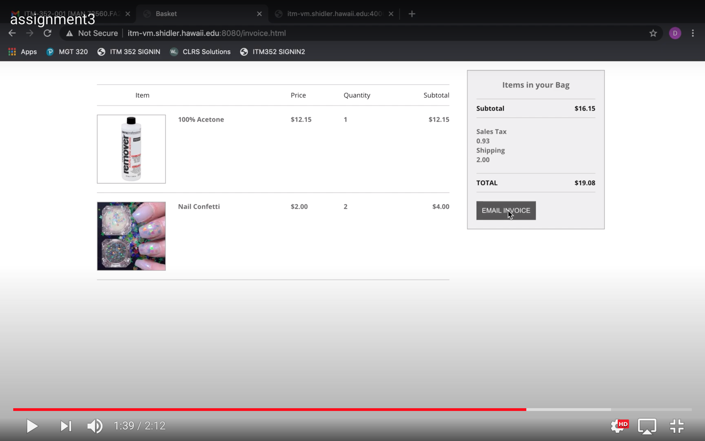

  
  
  

In my ITM 352 last semester class, we worked in JavaScript and HTML. The assignment started with building a simple e-commerce store with requirements from a client. The main requirements for this assignment was:
1. Use multidimensional arrays (an array that holds other arrays) to efficiently share and use data (display items and process invoice)
2. Use forms to allow users to select and process multiple products/services.information.
3. Validate data entered before using it (not just guarding against invalid input).
4. Connect multiple web pages and that dynamically interact with a user (web application).

More info can be found https://dport96.github.io/ITM352_NEW/morea/130.Assignment1/experience-Assignment1.html

I learned how to do data validation and use sticky values in programming the page. I was able to implement a complete IS application. I was sole designer of the user interface and process user input. I worked with managing information with data types and interpreting and following development requirements. 

